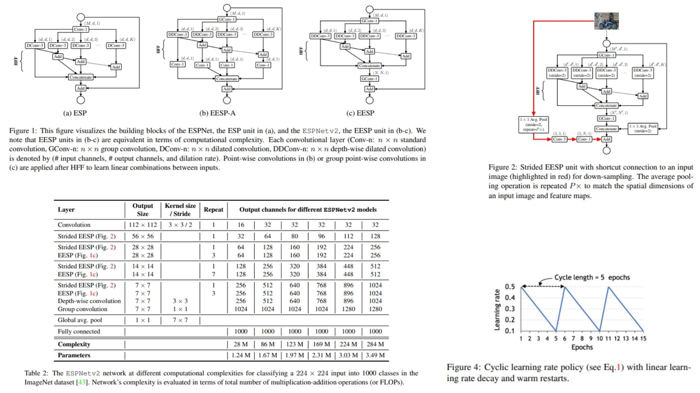

# 🛕 ESPNetv2-Replication

This repository provides a **faithful PyTorch replication** of the **ESPNetv2 architecture**, targeting efficient **mobile and edge deployment**. It reconstructs the full pipeline from the original paper, including **EESP blocks, depthwise dilated separable convolutions, group pointwise convolutions, and hierarchical feature fusion (HFF)**.

Paper reference: *ESPNetv2: A Light-weight, Power Efficient, and General Purpose Convolutional Neural Network*  https://arxiv.org/abs/1811.11431  

---

## Overview 🪐



> ESPNetv2 improves efficiency by replacing standard convolution with a **factorized design** that separates spatial filtering and channel mixing. It constructs a **spatial pyramid using depthwise dilated convolutions**, enabling large receptive fields with low computational cost.

Key ideas:

- **EESP Block**: main unit that builds a lightweight spatial pyramid using multiple dilation rates  
- **Depthwise Dilated Separable Convolution**: increases receptive field while reducing computational cost  
- **Group Pointwise Convolution**: replaces dense $$1 \\times 1$$ convolutions for efficient channel mixing  
- **Hierarchical Feature Fusion (HFF)**: fuses multi-branch outputs and reduces gridding artifacts  

---

## Core Math 📐

**Dilated receptive field:**

$$
n_r = (n - 1) \\cdot r + 1
$$

**Standard convolution complexity:**

$$
\\mathcal{O}(n^2 c \\hat{c})
$$

**Depthwise dilated separable convolution complexity:**

$$
\\mathcal{O}(n^2 c + c \\hat{c})
$$

**HFF (hierarchical fusion):**

$$
y_i = x_i + \\sum_{j=1}^{i-1} x_j
$$

$$
Y = \\text{Concat}(y_1, y_2, ..., y_K)
$$

**Group pointwise convolution:**

$$
Y = W_g * X
$$

---

## Why ESPNetv2 Matters ⚡

- Replaces $$\\mathcal{O}(n^2 c \\hat{c})$$ convolutions with factorized operations  
- Enables large receptive fields at low FLOPs  
- Designed for **edge and mobile inference**  
- Combines spatial pyramid structure with efficient channel grouping  

---

## Repository Structure 🏗️

```bash
ESPNetv2-Replication/
├── src/
│   ├── blocks/
│   │   ├── eesp_block.py
│   │   ├── strided_eesp_block.py
│   │   ├── depthwise_dilated_conv.py
│   │   ├── group_pointwise_conv.py
│   │   └── hff.py
│   │
│   ├── modules/
│   │   ├── stem.py
│   │   └── esp_stage.py
│   │
│   ├── model/
│   │   └── espnetv2.py
│   │
│   └── config.py
│
├── images/
│   └── figmix.jpg
│
├── requirements.txt
└── README.md
```

---

## 🔗 Feedback

For questions or feedback, contact:  
[barkin.adiguzel@gmail.com](mailto:barkin.adiguzel@gmail.com)
